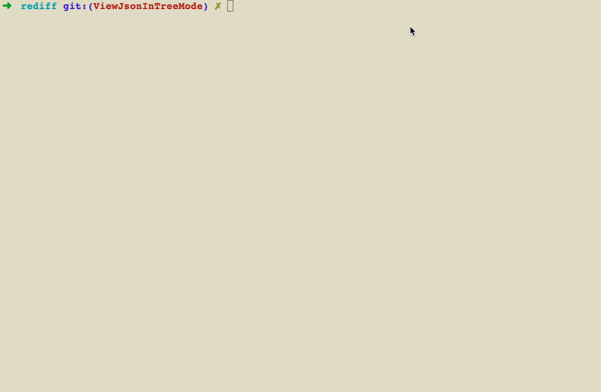

## Background
Sometime, when refactoring a legacy codebase, we need confirming/comparing response/payload of before and after refactoring.
It should be better if there is no changed of responses/payloads.
This tool is used for comparing output of requests (in same url's path but different servers mostly) when new version of source code was released and the old one.

## Install

```
git clone https://github.com/manhdaovan/rediff.git
cd rediff
gem install bundle
bundle install
```

## Usage
`$bundle exec ruby rediff.rb action [urls] [options]`

In detail:

```
ACTION
    The action of operation.
    Available actions are login|diff|clear_cookies

URLS
    The URL syntax is protocol-dependent. You'll find a detailed description in RFC 3986.
    You can specify multiple URLs continuously like:

    $ruby rediff.rb diff https://example.com/sign_in https://other-example.com/sign_in [options]
    NOTE: if action is clear_cookies then url can be 'all' for clear all saved cookies
    Eg: $bundle exec ruby rediff.rb clear_cookies all [options]

OPTIONS
       Options start with one or two dashes. Many of the  options  require  an
       additional value next to them following by "=".

       -m, --method=<method>
              HTTP(s) method would be used to request to servers.
              Available methods: get|post|put

       -p, --params=<request params>
              Params would be used in request.
              Eg: --params="user[email]=email@example.com&password=123456"

       -f, --format=<format>
              Format of output with compatible viewing.
              Available formats: color|text|html|html_simple
              color: export to stdio with colors
              text: open output in text editor
              html_simple: open output in browser
              html: same as html_simple

       --auth-token-attr=<auth token attr>
              Attribute of html input tag that contains authenticity token.
              Default: "authenticity_token" that means input as bellow:
              <input name="authenticity_token" value="authenticity_token_value" />

       --form-action-attr=<form action attr>
              Attribute of html form tag that contains form action.
              Default: "action" that means form as bellow:
              <form action="/action_value" />

       --form-method-attr=<form method attr>
              Attribute of html form tag that contains form method.
              Default: "method" that means form as bellow:
              <form method="/method_value" />

       -v, --verbose
              Output executed steps verbosely
```

Run `$bundle exec ruby rediff.rb --help` for more details.

## Some screenshots

### View diff in terminal directly
`$bundle exec ruby rediff.rb diff http://localhost:3000/html http://localhost:4000/html`


### View diff in html format (github like)
`$bundle exec ruby rediff.rb diff http://localhost:3000/html http://localhost:4000/html --format=html`


## TODO
* [x] Add response time of each request
* [x] Support viewing json format in tree mode
